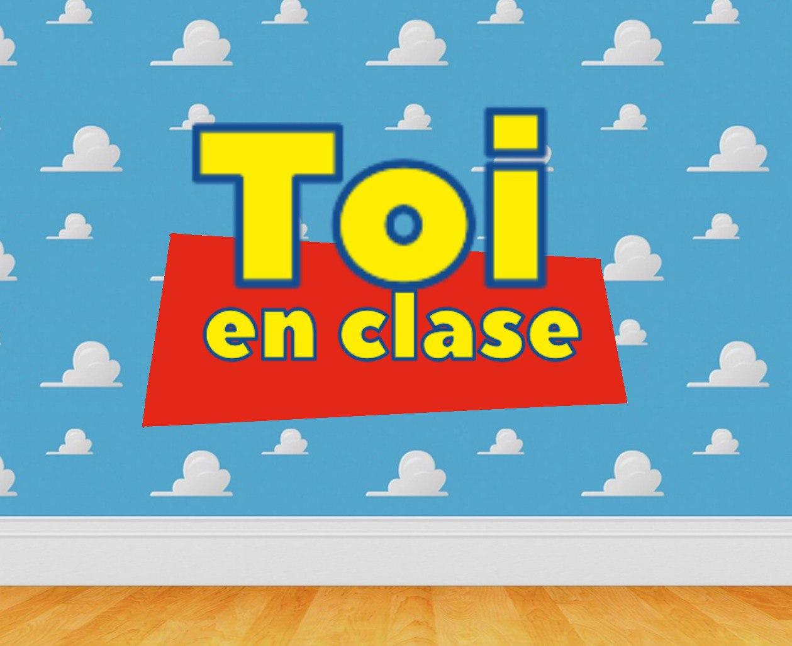

# Toi



"Toi" is a colloquial/slang for "Estoy", or "I am", in Spanish. This is a
 base class to register an unique ID and position in a classroom or other
 , with the main target of traceability in case of a COVID-19 positive.
 
Unique IDs are used instead of names so that it's easy to use from, for
  instance, Telegram; coordinates would, in general, correspond to desk
   positions but the main idea is that they are stored so that you can search
    for persons with the highest infection likelihood.

## Installing and running

Toi can be installed form the ecosystem, with `zef install Toi`

You will need, however, to install the `Telegram` distribution from the
 ecosystem, and obtain a bot key from Telegram to start the `toi` command
 -line interface.
 
```bash
export TOI_BOT_TOKEN=<token provided by The Botfather>
toi <file-to-store-positions>
```

You will need to add the bot you've created to a group, or else tell the
 students to interact with it.
 
My use case is I use it from my laptop during class, clarifying the
 coordinates and how they work.


## Contributing

We're open to contributions. For instance, a REST API or a websockets API
 would be nice.


## License

Licensed under the Artistic 2.0 License.
